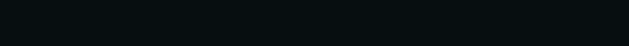

# Super Progress Bar

Super progress bar is a CLI progress bar.



It accepts a pattern string that contains tokens that represent the different fields that can be output in the progress bar.

```typescript
// Default pattern string
let pb = Progress.create({
  pattern: `[{spinner}] {bar} | Elapsed: {elapsed} | {percent}`
});
```

It also accepts a set of custom token definitions that define the various tokens in the pattern string as well as how to render each token.

```typescript
// Example token definition
{
  percent: {
    render: (state: ProgressState, allowed: number): string => {
      return (state.percentComplete * 100).toFixed(2) + '%';
    },
    width: () => 7
  }
}
```
### Token Definition
Each token is specified within the pattern string by its key, surrounded by curly braces (ex. ```{bar}```).  If a custom token has the same key as a default token, the default token is replaced.

Each token definition is composed of three parts:
- It's key, which you insert into the pattern string to indicate where to put the rendered token
- A function that returns a number indicating the width of the rendered token, in single characters.  Each token may instead return a -1 to to indicate that it will take as much space as is available (more on that below)
- A function that returns the rendered token

Multiple instances of the same token are allowed in the pattern string.

### Rendering
The progress bar rendering function uses a two-pass process to render the whole bar.

On the first pass, each token is queried for its rendered width. If a token returns a -1 instead of a width, this indicates that the token is variable-width and will use the space allotted to it by the render function.

On the second pass, all of the widths of the known-width tokens and 'literal' characters (characters that are not a part of any known token) in the pattern string are added together and subtracted from the space available in the console.  The amount left over (if any) is then divided evenly across all of the tokens that returned a -1 on the first pass.  Every token's render function is then called with the current state of the progress bar and the allowed width per unknown-width token as arguments.  The return value of each render function is then inserted in place of the token's placeholder(s) in the pattern string.

## Installation
```
npm i -S super-progress
```

## Usage

### Typescript
```typescript
import { Progress } from 'super-progress';
import { clearInterval } from 'timers';

const pb = Progress.create();

let t = setInterval(() => {
  pb.update()
    .then(() => pb.render(process.stdout.columns))
    .then(r => pb.display(r, process.stdout))
    .then(() => {
      if (pb.state.percentComplete >= 1.0) {
        clearInterval(t);
      }
    })
}, 100);
```

### Javascript
```javascript
const progress = require('super-progress').Progress;

const pb = progress.create();

let t = setInterval(() => {
  pb.update()
    .then(() => pb.render(process.stdout.columns))
    .then(r => pb.display(r, process.stdout))
    .then(() => {
      if (pb.state.percentComplete >= 1.0) {
        clearInterval(t);
      }
    })
}, 100);
```

## API
### ProgressOptions
This can be passed to Progress.create() to customize the layout, token definitions, and capacity of the progress bar
```typescript
interface ProgressOptions {
  total?: number;
  pattern?: string;
  renderInterval?: number;
}
```
#### total
The capacity of the progress bar
#### pattern
The pattern string specifying where the tokens are to be inserted.  Each token can be used as many times as needed.

For example:
```
'{spinner}--{spinner} {indeterminate} {bar} {indeterminate} {spinner}--{spinner}'
```
yields


#### renderInterval
The minimum amount of time (in ms) to wait between frames.  This only applies if you use the display method provided in the Progress class.

### ProgressState
This contains the current state of the progress bar.  It can be saved and reused to restore the progress bar's state at a later time (for example, if the current process has to be interrupted).
```typescript
interface ProgressState {
  startTime: number;
  elapsedTime: number;
  remainingTime: number;
  nextRender: number;

  percentComplete: number;
  rateTicks: number;
  currentTicks: number;
  totalTicks: number;
  ticksLeft: number;
}
```
#### startTime
The time at which the progress bar was created, in the number of milliseconds elapsed since January 1, 1970 00:00:00 UTC.
#### elapsedTime
The amount of time (in ms) that has passed since the progress bar was created.
#### remainingTime
The estimated amount of time (in ms) remaining in the process.
#### nextRender
The time at which the next render should take place.  This only applies if you use the display method provided in the Progress class.
#### percentComplete
The amount of the process that has completed, as a percentage.
#### rateTicks
The rate of tick completion, calculated as ticks per millisecond.
#### currentTicks
The current number of ticks that have been completed.
#### totalTicks
The total number of ticks in the whole process (as provided to the Progress class constructor).
#### ticksLeft
The total number of ticks that remain in the process.

### ProgressTokenDefinitions
Contains the definitions of the tokens in the progress bar.
```typescript
interface ProgressTokenDefinitions {
  'key': {
    render: (state: ProgressState, allowed: number) => string;
    width: (state: ProgressState) => number;
  }
  . . .
}
```
#### key
The string that, when surrounded by curly braces ```{}``` and inserted into the pattern string, acts as the placeholder for the rendered content of the token.
#### render(state: ProgressState, allowed: number): string
The function that renders the token output.  The current state and the space allowance are given as inputs.
#### width(state: ProgressState): number
This function indicates how much space the token will take up (in characters) when rendered.  A return of -1 indicates that the token will take up as much space as is available to it.

### Progress
Main class that represents the progress bar
```typescript
export class Progress {
  public static create(options?: ProgressOptions, tokens?: ProgressTokenDefinitions, state?: ProgressState): Progress
  public async display(rendered: string[], stream: Writable): Promise<void>
  public async update(ticks: number = 1): Promise<void>
  public async render(width: number): Promise<string[]>
}
```

#### create(options?: ProgressOptions, tokens?: ProgressTokenDefinitions, state?: ProgressState): Progress
Creates a new Progress object using the specified parameters.

Default parameters:
```typescript
options = {
    total: 100,
    pattern: `[{spinner}] {bar} | Elapsed: {elapsed} | {percent}`,
    renderInterval: 33
}

tokens = {
    // the bar token displays a bar showing how much of a process has
  // completed.  It takes up as much space as the layout engine will
  // allow.  This is specified by returning -1 in the width function.
  bar: {/*...*/},

  // the elapsed token displays the amount time that has elapsed since
  // the beginning of the process.  It is displayed in hh:mm:ss.sss format.
  // Since we know the exact width of the desired output, we return it
  // in the width function.
  elapsed: {/*...*/},

  // the percent token displays the amount of the process that has been
  // completed as a percentage.  It shows 2 decimal places of precision.
  percent: {/*...*/},

  // The spinner token simply displays an ascii 'wheel' that constantly
  // spins as the process is occurring.
  spinner: {/*...*/}
}

state = {
  elapsedTime: 0,
  remainingTime: 0,
  percentComplete: 0,
  currentTicks: 0,
  rateTicks: 0,
  nextRender: 0,
  startTime: Date.now(),
  totalTicks: 100,  // or the value supplied in options, if supplied
  ticksLeft: 100, // or the value supplied in options, if supplied
}
```

#### display(rendered: string[], stream: Writable): Promise<void>
Displays the strings in rendered on the provided stream.  Each entry in the array represents a line.  This function joins the array with os.EOL, writes it to the stream and repositions the cursor to the beginning of the line on which it started.

#### update(ticks?: number = 1): Promise<void>
Updates the state of the progress bar by the specified number of ticks.

#### render(width: number): Promise<string[]>
Renders the progress bar in its current state.  The width specifies how many characters are available on each line.
